# Disaster Recovery Analysis - Vaultwarden Integration

**Date:** 2025-12-23
**Status:** ⚠️ CRITICAL GAP IDENTIFIED

## Executive Summary

**FINDING:** The current Ansible deployment **DOES NOT** include automated Vaultwarden restoration from restic backups. The disaster recovery test (Phase 7) **WILL FAIL** without implementing a restic restore task.

**IMPACT:** Complete infrastructure loss scenario cannot be recovered automatically - Vaultwarden data will not be restored, causing all vaultwarden lookup plugin calls to fail.

---

## Current Ansible Execution Order

### Phase 1: system.yml (Root Tasks)
```
1. Package installation
2. Storage Box configuration
   ├─ Fetch credentials from Vaultwarden ❌ (fails if VW not running)
   └─ Mount Storage Box via CIFS
3. System services (fail2ban, monit, etc.)
```

### Phase 2: user.yml (User Tasks)
```
1. Git credentials ✅ (uses Vaultwarden lookup)
2. Docker repository clone
3. OBSOLETE: docker_repo_restore.yml
   ├─ Lines 73-83: Restore pass/vw-data from backup_dir
   ├─ backup_dir = /mnt/storagebox/backup/servyy-test.lxd
   └─ ❌ FILES DON'T EXIST (restic stores encrypted, not plain files)
4. Docker setup
5. Docker services deployment
   └─ Starts Vaultwarden container ✅
6. Restic initialization
   └─ Fetches restic_password_root from Vaultwarden ✅ (VW now running)
```

### Phase 3: leaguesphere.yml
```
1. LeagueSphere deployment
   └─ Fetches secrets from Vaultwarden ✅
```

### Phase 4: testing.yml
```
1. mkcert CA setup
2. Extra hosts configuration
```

---

## Current Disaster Recovery Flow (BROKEN)

```mermaid
graph TD
    A[Fresh Container] --> B[system.yml: Mount Storage Box]
    B --> C[user.yml: docker_repo_restore.yml]
    C --> D{Files exist at<br>/mnt/storagebox/backup/.../pass/vw-data?}
    D -->|NO - restic stores encrypted| E[❌ Restore SKIPPED]
    E --> F[Docker services deploy]
    F --> G[Vaultwarden starts with EMPTY data]
    G --> H[restic.yml: Fetch password from VW]
    H --> I[❌ LOOKUP FAILS - No items in empty VW]
    I --> J[🔥 DEPLOYMENT FAILS]

    style D fill:#ff6b6b
    style E fill:#ff6b6b
    style G fill:#ff6b6b
    style I fill:#ff6b6b
    style J fill:#ff6b6b
```



---

## Required Disaster Recovery Flow (CORRECT)

```mermaid
graph TD
    A[Fresh Container] --> B[system.yml: Storage Box setup]
    B --> B1{Storage Box credentials}
    B1 -->|BOOTSTRAP| B2[Use SSH key from git-crypt]
    B2 --> C[Mount Storage Box via SFTP<br>NOT CIFS]
    C --> D[NEW: restic_restore.yml]
    D --> E{Restic backup exists?}
    E -->|YES| F[restic restore latest<br>--target .../pass/vw-data]
    E -->|NO| G[Skip restore<br>Fresh install]
    F --> H[Docker services deploy]
    G --> H
    H --> I[Vaultwarden starts]
    I --> J{VW data restored?}
    J -->|YES| K[✅ All 15 items available]
    J -->|NO| L[Empty VW - seed required]
    K --> M[restic.yml: Fetch password from VW]
    M --> N[✅ All lookups succeed]
    N --> O[🎉 DEPLOYMENT SUCCEEDS]

    style B2 fill:#51cf66
    style F fill:#51cf66
    style K fill:#51cf66
    style N fill:#51cf66
    style O fill:#51cf66
```



---

## Dependency Chain Analysis

### ❌ Current (Broken) Chain

```
Fresh Container
└─ system.yml
   ├─ Storage Box mount (CIFS) ⚠️ Requires VW password
   └─ ❌ CIRCULAR DEPENDENCY

user.yml
├─ docker_repo_restore.yml ❌ Files don't exist
├─ Docker services ✅ Starts VW with empty data
└─ restic.yml ❌ VW empty, lookup fails
```

### ✅ Required (Working) Chain

```
Fresh Container
└─ system.yml
   ├─ Storage Box SSH key ✅ From bootstrap_secrets.yml (git-crypt)
   └─ Mount via SFTP ✅ No password needed (SSH key auth)

user.yml
├─ NEW: restic_restore.yml ✅ Uses bootstrap restic_password_home
│  └─ Restore: restic restore latest --target .../pass/vw-data
├─ Docker services ✅ Starts VW with restored data
└─ restic.yml ✅ VW has data, lookup succeeds
```

---

## Critical Bootstrap Dependencies

These MUST remain in `bootstrap_secrets.yml` (git-crypt):

| Secret | Why Bootstrap | Used When |
|--------|---------------|-----------|
| Storage Box SSH key | Needed to access restic repos | system.yml (before VW starts) |
| `restic_password_home` | **Circular dependency**: Restores VW data | user.yml (before VW starts) |
| Vaultwarden API credentials | Needed to unlock VW vault | After VW restored |
| Vaultwarden master password (test) | Needed to unlock VW vault | After VW restored |

**Circular Dependency Explanation:**
- Vaultwarden data is at `/home/cda/servyy-container/pass/vw-data`
- This directory is backed up by restic HOME backup
- HOME backup password CANNOT be in Vaultwarden
- Must be in git-crypt to bootstrap the restoration

---

## Identified Issues

### Issue 1: No Restic Restore Task ❌ CRITICAL

**Problem:** No Ansible task to run `restic restore` for Vaultwarden data

**Location:** Missing from `ansible/plays/roles/user/tasks/main.yml`

**Impact:** Vaultwarden starts empty, all lookups fail

**Fix Required:** Create `restic_restore.yml` task file

**Proposed Task:**
```yaml
---
# Restore Vaultwarden data from restic backup (disaster recovery)

- name: Check if Vaultwarden data directory exists
  stat:
    path: "{{ (docker.remote_dir, 'pass', 'vw-data') | path_join }}"
  register: vw_data_dir

- name: Check if Vaultwarden data is empty
  find:
    paths: "{{ (docker.remote_dir, 'pass', 'vw-data') | path_join }}"
    file_type: any
  register: vw_data_files
  when: vw_data_dir.stat.exists

- name: Restore Vaultwarden data from restic HOME backup
  shell: |
    export RESTIC_PASSWORD="{{ restic_password_home }}"
    export RESTIC_REPOSITORY="sftp://storagebox/{{ storagebox_credentials.share }}/{{ inventory_hostname }}/restic-home"
    restic restore latest \
      --target / \
      --path "{{ (docker.remote_dir, 'pass', 'vw-data') | path_join }}"
  when: >
    not vw_data_dir.stat.exists or
    (vw_data_files.matched is defined and vw_data_files.matched == 0)
  no_log: true
  tags:
    - user.docker.restore.vaultwarden
```

**Insert Location:** Line 49 in `user/tasks/main.yml` (BEFORE docker_repo_restore tasks)

---

### Issue 2: Obsolete docker_repo_restore.yml ⚠️ WARNING

**Problem:** Task expects plain files at backup_dir, but restic stores encrypted

**Location:** Lines 49-83 in `ansible/plays/roles/user/tasks/main.yml`

**Impact:** Always skipped (files don't exist), misleading

**Fix Required:**
- Option 1: Remove obsolete tasks (backup.yml already disabled)
- Option 2: Convert to use restic restore instead of file copy

**Recommendation:** Remove entirely - replaced by restic

---

### Issue 3: Storage Box CIFS Mount Circular Dependency ❌ CRITICAL

**Problem:** storagebox.yml fetches credentials from Vaultwarden (line 11-15)

**Location:** `ansible/plays/roles/system/tasks/storagebox.yml`

**Current Code:**
```yaml
- name: Fetch Storage Box credentials from Vaultwarden
  set_fact:
    storagebox_user: "{{ lookup('vaultwarden', 'infrastructure/test/storagebox/credentials', field='username') }}"
    storagebox_password: "{{ lookup('vaultwarden', 'infrastructure/test/storagebox/credentials', field='password') }}"
```

**Impact:** Lookup fails if Vaultwarden not running (disaster recovery scenario)

**Fix Required:**
- CIFS mount credentials must come from bootstrap OR
- Don't mount via CIFS, use SFTP with SSH key (already in bootstrap)

**Recommendation:** Keep SSH key in bootstrap, remove CIFS mount requirement

---

### Issue 4: restic.yml Fetches Password Too Early ⚠️ TIMING

**Problem:** restic.yml runs AFTER docker services, so this actually works

**Location:** Line 5-11 in `ansible/plays/roles/user/tasks/restic.yml`

**Current:** WORKS because restic tasks run after Vaultwarden is started

**No Fix Needed:** Timing is correct, just needs VW data restored first

---

## Execution Order Dependencies

### Correct Sequence (with fixes):

```
1. system.yml
   ├─ Storage Box SSH key (bootstrap) ✅
   └─ SKIP CIFS mount (not needed) ✅

2. user.yml
   ├─ NEW: restic_restore.yml ✅
   │  └─ Uses restic_password_home (bootstrap)
   ├─ Docker services ✅
   │  └─ Starts Vaultwarden with restored data
   └─ restic.yml ✅
      └─ Fetches restic_password_root from VW (now has data)
```

---

## Validation Checklist

Before disaster recovery test:

- [ ] Create `restic_restore.yml` task
- [ ] Add restore task to user/tasks/main.yml (line 49)
- [ ] Fix Storage Box mount dependency (use SSH key only)
- [ ] Remove obsolete docker_repo_restore.yml tasks
- [ ] Test on servyy-test.lxd
- [ ] Verify all 15 Vaultwarden items restored
- [ ] Verify all lookups succeed

---

## Test Plan (Dry Run)

### Step 1: Manual Restic Restore Test

```bash
# On servyy-test.lxd
export RESTIC_PASSWORD='2joaLNNlEuNvFBBCl0FjCLhyAJxKgoc2'
export RESTIC_REPOSITORY='sftp://storagebox/backup/servyy-test.lxd/restic-home'

# List snapshots
restic snapshots

# Test restore (dry run)
restic restore latest --target /tmp/restore-test --dry-run

# Actual restore to correct location
restic restore latest --target / --path /home/ubuntu/servyy-container/pass/vw-data
```

### Step 2: Ansible Dry Run

```bash
# Add restic_restore.yml task
# Run deployment in check mode
cd /home/cda/dev/infrastructure/container/ansible
./servyy-test.sh --check

# Review what would change
```

### Step 3: Actual Deployment

```bash
# Delete container
lxc delete servyy-test --force

# Recreate
cd /home/cda/dev/infrastructure/container/scripts
./setup_test_container.sh

# Deploy with restic restore
cd ../ansible
./servyy-test.sh

# Verify Vaultwarden items
ssh servyy-test.lxd "docker exec pass.vaultwarden ls -la /data"
```

---

## Expected Outcomes

### If Restic Restore Implemented ✅

```
1. Container created from scratch
2. Storage Box accessed via SSH key (bootstrap)
3. restic restore runs, populates pass/vw-data
4. Vaultwarden starts with 15 items
5. All vaultwarden lookups succeed
6. All services deploy successfully
7. Total time: < 30 minutes
```

### If Restic Restore NOT Implemented ❌

```
1. Container created from scratch
2. Storage Box mount may fail (no VW password)
3. docker_repo_restore skipped (files don't exist)
4. Vaultwarden starts EMPTY
5. restic.yml lookup FAILS (no items in VW)
6. Deployment FAILS
7. Manual intervention required
```

---

## Recommendations

### Immediate Actions (Required for Phase 7)

1. **Create restic_restore.yml task** - CRITICAL
2. **Fix Storage Box mount dependency** - Use SSH key from bootstrap
3. **Test restic restore manually** - Verify backup exists and is restorable

### Future Improvements

1. **Remove obsolete tasks** - Clean up docker_repo_restore.yml
2. **Add restore verification** - Check VW data exists after restore
3. **Add disaster recovery documentation** - Step-by-step manual recovery
4. **Implement restore testing** - Regular DR drills

---

## Conclusion

**Current Status:** Disaster recovery test WILL FAIL without implementing restic restore

**Required Fix:** Add restic_restore.yml task before docker services deployment

**Estimated Fix Time:** 1-2 hours (implementation + testing)

**Risk Level:** HIGH - Complete data loss scenario not recoverable

**Recommendation:** DO NOT proceed with Phase 7 (container deletion) until restic restore task is implemented and tested.

